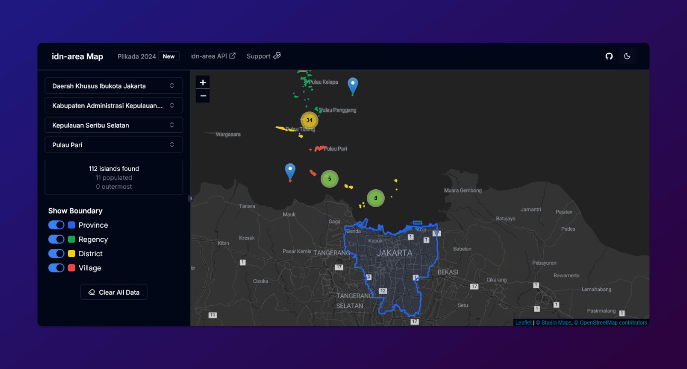

# idn-area Map

The map of Indonesia's administrative areas.

## Data Source

- Main data: [idn-area API](https://github.com/fityannugroho/idn-area)
- Boundary data: [idn-area-boundary](https://github.com/fityannugroho/idn-area-boundary)

## Features

- [x] Search provinces, regencies, districts, and villages by name
- [x] Get regencies by province, districts by regency, and villages by district
- [x] Get the islands by regency and show its coordinates on the map
- [x] Show the area boundaries on the map
- [x] Toggle the visibility of the boundaries
- [x] Button to see the area on Google Maps by coordinates
- [x] Dark mode
- [x] Responsive design (works on mobile)

> Suggestions and contributions are welcome!

## Built With

- [Next.js](https://nextjs.org) + [TypeScript](https://www.typescriptlang.org)
- [Tailwind CSS](https://tailwindcss.com) + [shadcn-ui](https://ui.shadcn.com)
- [React Leaflet](https://react-leaflet.js.org) + [MapLibre GL](https://github.com/maplibre/maplibre-gl-js) (powered by [Datawan](https://datawan.id))

## Installation

1. Clone this repository.
1. Install dependencies: `pnpm install`.
1. Copy `.env.example` to `.env` (or [any other environment file names](https://nextjs.org/docs/app/guides/environment-variables#environment-variable-load-order)) and modify the values as needed.
1. Run the app: `pnpm run dev`.
1. Open [http://localhost:3000](http://localhost:3000) with your browser to see the result.

## License

This project is licensed under the [MIT License](LICENSE).

## Support This Project

**Give a ⭐️** if this project helped you!

Also please consider supporting this project by [**becoming a sponsor**](https://github.com/sponsors/fityannugroho). Your donation will help us maintain and develop this project and provide you with better support.
